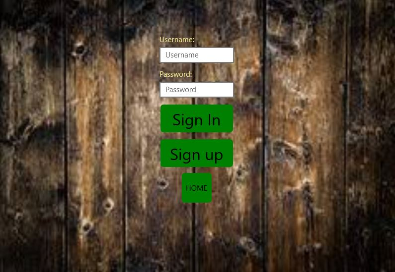

Technologies or plugins used:

          FirebaseDatabase.net    Version 4.0.1.    Used to connect to Firebase database server.
	  Microsoft.Data.Sqlite   Version  2.2.2.   Used to connect to SQLite database.
	  Microsoft.NETCore.UniversalWindowsPlatform    Version   6.1.5.
	  NETStandard.Library   Version      2.0.3.
	  SkiaSharp.Views.Forms    Version   1.68.0.    Used to draw the canvas on the Roulette board.
	  Xam.Plugin.Connectivity   Version  3.2.0.     Used to check for the Internet connectivity.
	  Xam.Plugin.SimpleAudioPlayer     Version   1.3.0.  Used to play sounds.
	  
Availibility to the public:

           Play Store:
	   Link: https://play.google.com/store/apps/details?id=com.mcndipenoch
	   App Name:Unlock Pin Code
	   Developer's name: com.mcndipenoch
	   
	        Windows Store:
	   Link: https://www.microsoft.com/store/productId/9P6D3KHXB9FT
	   App Nmae: Unlock PinCode
	   Developer's name: mcndipenoch
	   
	   
The app is a puzzle game the has a homepage,2 game boards(Square and Roulette), an account page, edit account page and a feedback page.
The homepage has a a link to the account page, and feedback page, users can choose from the drop down list to turn the background sound on/off using Xam.Plugin.SimpleAudioPlayer plugin.
Also, users can choose from a drop down list to game board they which to play on, either square or Roulette.
The homepage also have an exit button, to exit the application gracefully.

You can play the game with or without having an account.
The advantage of having an account is that if you have an account your highest score ever for both games are saved.
Each time you sign in, on the game board your highest score ever for that game will be displayed and will be update instantly if you get a higher score
and a welcome message with your user name will be displayed on the game board.
If you try to sign in or sign up with wrong user's details an appropriate error message will be displayed.
To sign in or sign up, you need an Internet connection as you details and scores are save and hosted on Firebase database server using FirebaseDatabase.net plugin.
Internet connection is detected using Xam.Plugin.Connectivity, if you don't have an Internet connection, an error message will be displayed and you will be sent to the homepage.
If you are on a PC or Laptops(UWP platform), you details are also stored locally on SQLite using Microsoft.Data.Sqlite.
SQLite is used on UWP platforms, because they are likely going to be more than one user on a PC or laptops, so SQL query is better to differentiate the accounts.
Firebase is use, so users can login on any device and retrieve their details including highest scores, even if the device is used by several account holders.
Each user can see just their own score or details.

The Roulette game board is constructed on a canvas using SkiaSharp.Views.Forms.
At the top left is a HOME button to go back to the home page and at the left will be the highest score ever if the user signs in.
This score will be updated instantly if the user get a higher score.
Just below the home button and the middle of the page is a LEVEL label and the current game level number.
Just below the LEVEL label  are 4 numbers generated randomly from 1-9 for each level.
Just below the random numbers are numbers 1-9 in a circle and a rotating stroke starting from the center moving clockwise, the stroke always start from zero.
The numbers and stroke(arm) are drawn on a canvas using SkiaSharp.Views.Forms.
Just below the canvas at the right is a PRESS button and at the left will be a welcome message with you user name if you are login.
If you finish level 4, a congratulation image and a replay button will be displayed below the canvas.
As the stroke(arm) rotates you have to click on the PRESS button when it is on the right number(one of the 4 randomly generated numbers).
The 4 random numbers are in order from left to right, you can click on the same number  more than one time if the number appears 2 or more times consecutively.
say 2 2, and the stroke(arm) is on 2, you can double click 2.
The order of the number must be maintain.
For each click, you either get it right or wrong.
If you get it right, a green tick will appear on the number to indicate you got it right and you can move to the next number and then to the next level after the 4th number.
For each number you get right, you get plus 10 points.
If you get it wrong, a red "X" will appear on the number, to indicate you fail and you will start from level 1 again and new set of random numbers will be generated each time.
For each level if you get all 4 numbers right, you will move to the next level and the speed of the rotating stroke will be faster than the previous level.
You will progress to the next level automatically after you get the 4th number right.
So, it will be challenging harder as you move to a higher level.

The Square game board.
At the top left is a HOME button to go back to the home page and at the left will be the highest score ever if the user signs in.
This score will be updated instantly if the user get a higher score.
Just below the HOME button and the middle of the page is a LEVEL label and the current game level number.
Just below the LEVEL label  are 4 numbers generated randomly for each level.
Below the LEVEL label are 9 squares buttons on 3 rows and 3 buttons per row.
The square buttons are enable one after the other and one at a time for a time interval(varies per level).
Once the square is enable a random number from 1-9 is displayed on the button. 
On this game board, you have to click the PLAY button to start to play. Once you click the PLAY button it becomes invisible.
The goal is to click the 4 random numbers on the squares one at a time from left to right. The order of the number is very important.
If you get it right, a green tick will appear on the number to indicate you got it right and you can move to the next number and then to the next level after the 4th number.
For each number you get right, you get plus 10 points.
You will progress to the next level automatically after you get the 4th number right.
If you are on UWP on each click you get right a gif image with clapping hands which will appear below the 9 squares for a quarter of a second.
If you get it wrong, a red "X" will appear on the number, to indicate you fail and you will start from level 1 again and a new set of random numbers will be generated each time.
For each level if you get all 4 numbers right, you will move to the next level and the time at which the button is enable decreases as you move  to a higher level
and more than one square can be enable at a time. Thus making the game challenging and harder as you move to a higher level.
If you click a button that is not enable not happens.
If you finish level 4, a congratulation image and a replay button will be displayed below the 9 squares.

My Account Page.
If you successfully sign in or sign up you are taken to MyAccount page.
If you are a first time user or you haven't changed your default information, default values are given to you account.
Here you can edit, log out and delete your account, with the respective buttons as indicated below the page.
If you delete you account, you details are deleted on the device, Firebase and SQLite for UWP users.

Edit Page.
Here you can edit you details and click on the SAVE buttons to update your details on the device, Firebase and SQLite for UWP users.

Feedback Page.
Here users can send to me their taught about the game and I will retrieve the message from the backend (Firebase).
Users, can contact me if they will like to retrieve their password and I will email it to them.
If users click on the button SUBMIT and either the name or comment fields are empty an alert message will be displayed to the screen to tell them these
fields are mandatory.

